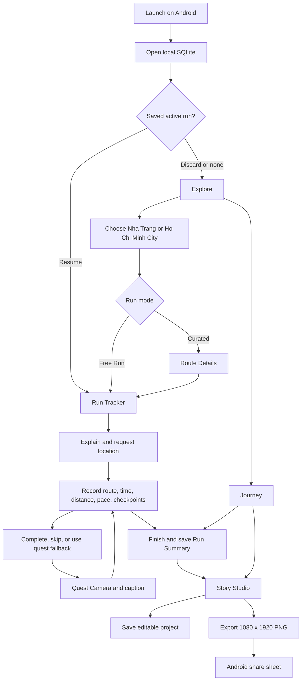

# Questory app guide

This guide explains the production Android flow and the focused Story Studio
development harness. The complete app is offline-first and does not wait for a
backend during startup.

## Production user flow

The production entry point is `lib/main.dart`. It assembles the real local
repositories, opens SQLite, and then shows Explore.



## Platform boundary

- Run `lib/main.dart` on an Android API 24+ device or emulator.
- A `databaseFactory not initialized` page means the production entry point
  was launched on Windows or in a browser. It is a platform mismatch, not a
  missing backend.
- Supabase is optional. Without `SUPABASE_URL` and `SUPABASE_ANON_KEY`, only
  the online-link button is hidden; the complete local flow remains available.

```powershell
flutter pub get
flutter devices
flutter run -d <android-device-id>
```

## Complete-app check

1. Open both bundled cities and a route while offline.
2. Start either the curated route or Free Run.
3. Deny location once, confirm recovery guidance, then grant permission.
4. Start, pause, resume, complete or skip a quest, and finish the run.
5. Restart the app and confirm the result remains in Journey.
6. Open Story Studio, edit and save a project, export its PNG, and open the
   Android share sheet.

## Story Studio testing

Run the focused automated tests from the repository root:

```powershell
flutter test test/features/story_studio
```

The standalone editor uses fixture data and an in-memory repository. It is
useful when no Android device is connected, but it does not test production
SQLite, GPS, camera, History, or Android sharing.

```powershell
flutter run -d edge -t lib/features/story_studio/story_studio_demo.dart
```

On Android, the same harness opens the native share sheet:

```powershell
flutter run -d <android-device-id> `
  -t lib/features/story_studio/story_studio_demo.dart
```

### Manual editor checklist

1. Switch among City Sprint, Film Roll, and Postcard Trail.
2. Select and move text, photo, route, statistic, quest, sticker, and location
   elements.
3. Test resize, rotate, crop, layer order, duplicate, delete, undo, and redo.
4. Change text, font, and solid colors, then save and reopen the project.
5. Export and confirm the PNG is exactly 1080 x 1920.
6. Confirm selection borders, guides, and editor controls are absent from the
   exported image.
7. Repeat editing and export in airplane mode.

For optional route-link sharing, continue with [SERVER_GUIDE.md](SERVER_GUIDE.md).
For final device and packaging checks, use [RELEASE_GUIDE.md](RELEASE_GUIDE.md).
