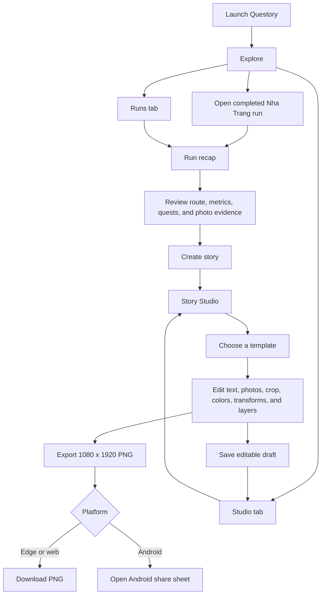

# Questory demo user flow

The release demo starts with Questory rather than the inherited camera screen.
It uses a completed offline run fixture so Story Studio can be demonstrated even
when GPS, camera hardware, or another team module is unavailable.

## Demo boundary

- Explore, Runs, and Run recap are fixture-driven navigation surfaces.
- Story Studio, document editing, save/reopen, rendering, and export are the
  real Story Studio implementation.
- The app-scoped fake repository acts as the mock backend for the current app
  session and returns cloned serialized documents.
- Edge DevTools does not emulate camera hardware. The demo run already contains
  deterministic quest evidence, so camera availability never blocks the Story
  Studio demonstration.
- Real camera evidence, GPS tracking, durable storage, and release navigation
  remain replaceable integration adapters owned by their respective modules.
