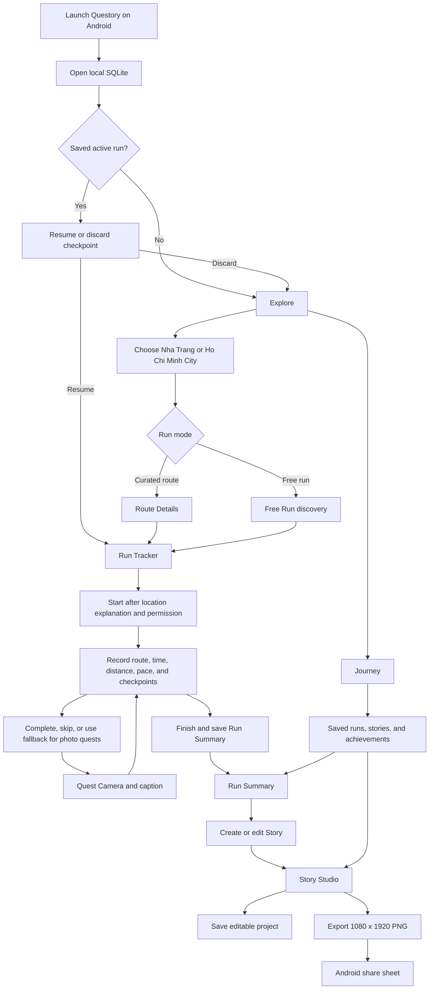

# Questory production user flow

The production entry point is `lib/main.dart`. It assembles the real local
repositories, opens SQLite, and then shows the Android application. The core
journey works offline and does not wait for Supabase or any other backend.



## Startup and platform boundary

- `lib/main.dart` currently supports the Android release flow. It opens the
  `sqflite` database before `MainNavigation` is created.
- A `databaseFactory not initialized` screen means the production entry point
  was launched on Windows or in a browser, where this database factory is not
  configured. It is not a missing backend and retrying on the same target will
  return the same error.
- Start or connect an API 24+ Android target, confirm its ID with
  `flutter devices`, and run `flutter run -d <android-device-id>`.
- Supabase is optional. Without `SUPABASE_URL` and `SUPABASE_ANON_KEY`, the
  online route-sharing button is hidden and the complete local flow remains
  available.

## Development-only Story Studio demo

The repository also contains an isolated, fixture-driven editor at
`lib/features/story_studio/story_studio_demo.dart`. It is useful when no
Android target is connected and can run in Edge:

```shell
flutter run -d edge -t lib/features/story_studio/story_studio_demo.dart
```

That command opens Story Studio directly with sample run data and an in-memory
story repository. It does not exercise production startup, SQLite persistence,
GPS tracking, the quest camera, History, or Android sharing.
